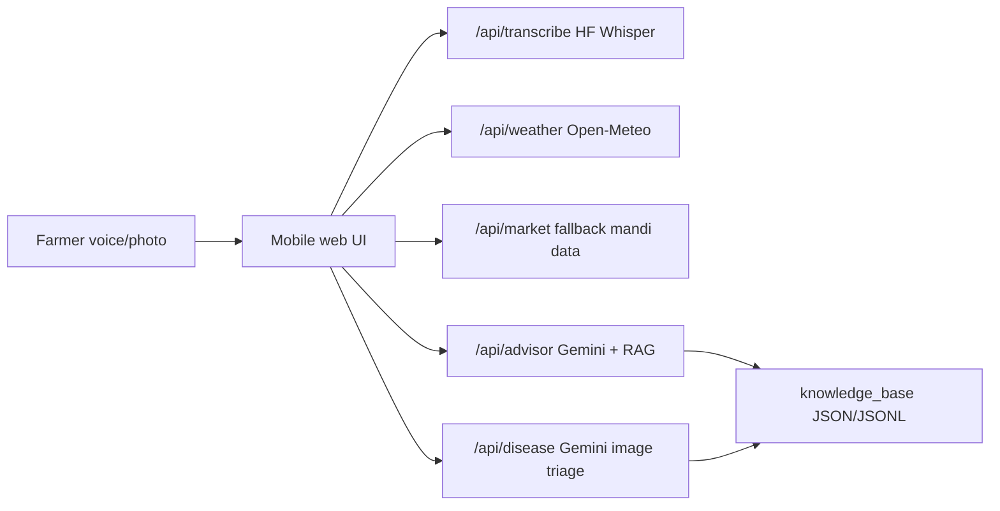

# KisaanVaani Architecture

## Modules

1. Weather & Market Intelligence
2. Disease Identification & Organic Treatment

## Request Flow

## Why Vercel Functions

Gemini and Hugging Face tokens must stay server-side. Vercel Functions provide a simple API layer while keeping the frontend static and fast.

## Whisper Tradeoff

The requested Whisper source is Hugging Face. The repo includes `scripts/download-whisper.mjs` to download Whisper artifacts. Running Whisper inference inside Vercel Functions is usually not practical because of model size and runtime limits, so `/api/transcribe` supports:

- Hugging Face Inference API with `HF_TOKEN`
- a custom downloaded-model endpoint via `WHISPER_ENDPOINT_URL`

## Guardrail Model

All AI routes receive local context from `knowledge_base/` and must:

- recommend organic/zero-chemical practices only,
- disclose confidence,
- avoid final diagnosis from photo alone,
- require local mandi/KVK/agriculture officer verification for high-risk decisions.
